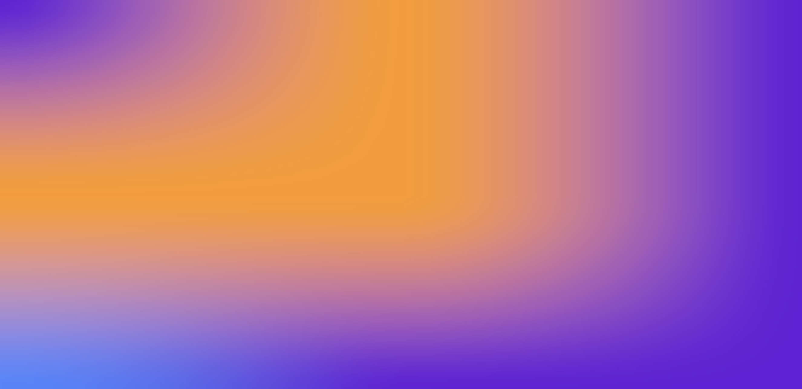

# Swift Gradient



```js
const PURPLE = "#a960ee";
const RED = "#ff333d";
const CYAN = "#90c0ff";
const ORANGE = "#ffcb57";

const gradientMeshConfig = {
  width: 3,
  height: 3,
  points: [
    [0.0, 0.0], [0.5, 0.0], [1.0, 0.0],
    [0.0, 0.5], [0.5, 0.5], [1.0, 0.5],
    [0.0, 1.0], [0.5, 1.0], [1.0, 1.0],
  ],
  colors: [
    PURPLE, ORANGE, PURPLE,
    ORANGE, ORANGE, PURPLE,
    CYAN, PURPLE, PURPLE,
  ],
};

const canvas = document.getElementById("default");
renderGradientMesh(gradientMeshConfig, canvas);
```
